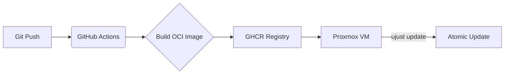

# ☁️ Cloud Native Gaming & Development Rig

[](https://github.com/danielvollbro/<your-repo>/actions/workflows/build.yml)
[](https://blue-build.org/)
[-blue)](https://getaurora.dev/)

> **An immutable, declarative, and atomic workstation managed via GitOps.**
> *Designed for high-performance headless cloud gaming and development.*

## 📖 About
This repository contains the source code for my personal operating system image. The goal is to treat the workstation as **Immutable Infrastructure**.

The system is built automatically via GitHub Actions as an OCI container (Docker image), signed, and pushed to a registry. My cloud VM pulls updates in the background and applies them atomically upon the next reboot.

No configuration drift. No manual patching. If something breaks? `rpm-ostree rollback`.

**Scope:** This repository specifically targets my **Virtual Machine (Cloud Rig)**. Physical thin clients will be managed in a separate repository.


## 🏗 The Workstation Ecosystem

| Repository | Role | Description |
| :--- | :--- | :--- |
| **`workstation-headless`** | **Compute Host** | **This repo.** The powerful backend VM doing the heavy lifting. |
| `workstation-desktop` | Thin Client | Lightweight OS for physical endpoints connecting to the host. |
| `workstation-dotfiles` | Config | Unified configuration (Chezmoi) for both environments. |


## 🏗 Architecture & Tech Stack



* **Base OS:** [Aurora DX](https://getaurora.dev/) (Fedora Silverblue/Atomic fork with KDE Plasma).
* **Build System:** [BlueBuild](https://blue-build.org/).
* **Gaming:** Nvidia Drivers (baked in), Steam (Flatpak), Sunshine (Headless Host).
* **Development:** VS Code, Podman, Distrobox (for mutable dev environments).
* **Configuration:**
* **OS Level:** `recipe.yml` & `files/` (System-wide configs).
* **User Level:** [Chezmoi](https://www.chezmoi.io/) (Dotfiles management).


## 🎮 Headless Cloud Setup

This image is optimized to run on a **Proxmox Virtual Machine** with PCI-E GPU Passthrough.

* **GPU:** Nvidia RTX 3070 (Passed through to VM).
* **Streaming:** [Sunshine](https://github.com/LizardByte/Sunshine) acts as the low-latency host server.
* **Client Access:** Accessed via [Moonlight](https://moonlight-stream.org/) from physical thin clients (laptop, TV, mobile).
* **Display Handling:** Uses a Dummy Plug (or virtual display driver) to force high-resolution rendering without a physical monitor attached.

## 🚀 Key Features

### ✅ Immutable & Atomic

The root filesystem (`/usr`) is read-only. All system changes are defined in this git repository. Updates are transactional—they either succeed completely or not at all.

### 📦 Container-First Workflow

Development environments are strictly separated from the host OS.

* **Distrobox:** Used to spin up mutable environments (Arch, Ubuntu, Fedora) for compilation and tooling.
* **Flatpak:** All GUI applications (Steam, Discord, Browsers) run in sandboxed containers.

### 🛠 Zero-Touch Reproducibility

From an empty disk to a fully functional gaming rig:

1. **PXE Boot/ISO:** Install the base image.
2. **Rebase:** The system connects to `ghcr.io/<user>/<repo>`.
3. **Chezmoi:** `chezmoi init --apply` pulls user configurations and scripts.
4. **Done.**

## 📂 Repository Structure

```text
├── recipe.yml           # "The Source of Truth". Defines packages and modules.
├── files/               # Files copied directly to root / (e.g., /etc/X11/...)
│   ├── system/
│   │   ├── etc/
│   │   │   ├── sddm.conf.d/  # Auto-login configuration
│   │   │   └── X11/          # Xorg configurations for headless/Nvidia
├── .github/workflows/   # CI/CD pipelines for building the OCI image.
└── README.md
```

## 🛠 Installation / Forking

To build your own version:

1. Fork this repository.
2. Edit `recipe.yml` to suit your needs.
3. Enable GitHub Actions.
4. Wait for the build to finish.
5. Install Aurora/Fedora Atomic and run:

```bash
rpm-ostree rebase ostree-unverified-registry:ghcr.io/danielvollbro/workstation-headless:latest
```

## 🖥️ EDID Emulation

To get headless support for **4K @ 30-144Hz** and **1440p @ 120-144Hz**, I use a custom EDID based on the [AOC U27G4R](https://aoc.com/us/gaming/products/monitors/u27g4r).

> **Credit:** Thanks to [linuxhw](https://github.com/linuxhw/EDID) on GitHub for the source dump!

### ⚠️ Important Note

The raw dump from the Linux HW database is **768 bytes** (contains redundant blocks), which causes the Nvidia driver to reject the firmware at boot (`*ERROR* Invalid firmware EDID`). To fix this, the file must be trimmed to exactly **384 bytes** (Base Block + 2 Extensions).

### Manual Fix & Installation

1. **Get the Hex Data:**
Go to the [AOC U27G4R Dump](https://github.com/linuxhw/EDID/blob/master/Digital/AOC/AOCB473/A11770E6239B) and copy the hexadecimal text.

2. **Clean the Data:**
* Paste the text into a file named `edid.txt` (e.g., using VS Code).
* Remove all non-hex text (headers, footers, timestamps).
* **Crucial Step:** The file contains 6 blocks. Keep only the first **3 blocks** (Block 0, 1, and 2). Delete the last 3 blocks (Block 3, 4, and 5).

3. **Convert to Binary:**
Run the following command to clean formatting and convert to a binary file:
```bash
cat edid.txt | grep -E '^([a-f0-9]{32}|[a-f0-9 ]{47})$' | tr -d '[:space:]' | xxd -r -p > edid.bin
```

4. **Verify Integrity:**
Ensure the file is exactly **384 bytes**.
```bash
ls -l edid.bin
# Output MUST be 384 bytes
```
*(Optional: verify content with `edid-decode edid.bin`)*

5. **Install & Configure:**
Move the file to `/usr/lib/firmware/edid/` and apply kernel arguments:
```bash
rpm-ostree kargs \
    --append="nvidia-drm.modeset=1" \
    --append="nvidia-drm.fbdev=1" \
    --append="video=DP-1:e" \
    --append="drm.edid_firmware=DP-1:edid/edid.bin"
```
*(Note: Replace `DP-1` with your actual output from `kscreen-doctor -o`)*

### ⏳ First Boot Provisioning

On the very first boot after flashing, the system will automatically detect the missing EDID configuration.

* **Status:** The system configures kernel arguments and regenerates the initramfs.
* **Duration:** ~3-5 minutes.
* **Behavior:** The system will remain offline (Sunshine/SSH might be delayed) and then automatically reboot.
* **Result:** Upon the second boot, 4K/144Hz is active and the system is ready immediately.

---

<div align="center">
<sub>Built with ❤️ and YAML by Daniel Vollbro.</sub>
</div>